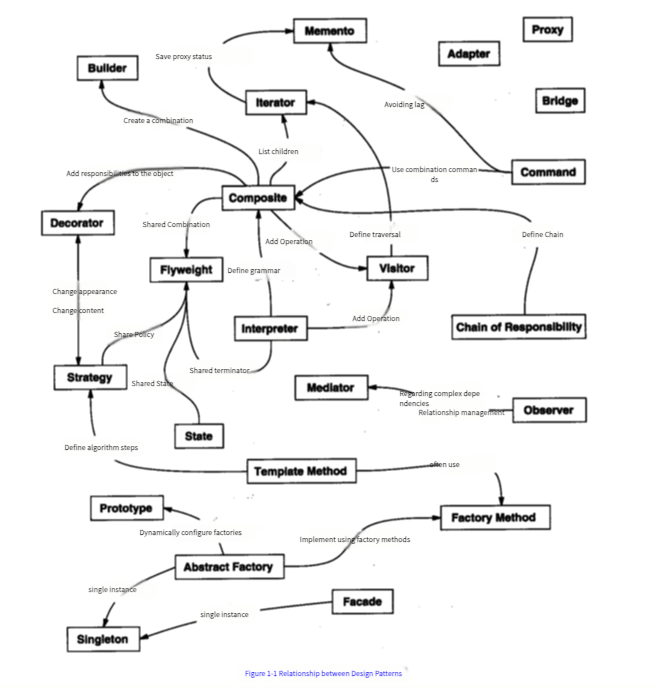

<!--more-->
> Design Pattern is a summary of code design experience that is repeatedly used, known to most people, and practiced by countless engineers. It is a highly refined and templated version of object-oriented thinking. The purpose of using design patterns is to make the code more reusable, more flexible and scalable, and easier to read and understand.

## Seven development principles

| development principles | induction | purpose |
| :---: | :---: | :---: |
| Single Responsibility Principle | A class is responsible for one responsibility | Easy to understand and improve code readability |
| Liskov Substitution Principle | Do not destroy the inheritance system. The function of the subclass overridden method should not affect the meaning of the parent class method. | Preventing inheritance flooding |
| Dependency Inversion Principle | High-level layers should not depend on low-level layers, programming should be interface-oriented | More conducive to upgrading and expanding the code structure |
| Interface Segregation Principle | An interface should only do one thing. The interface should be concise and simple, with as few methods as possible. | Functional decoupling, high aggregation, low coupling |
| Law of Demeter | Don't know what you shouldn't know. A class should keep the least knowledge of other objects to reduce coupling. | Reduce code bloat |
| Open/Closed Principle | Open for extension, closed for modification | Reduce new risks brought by maintenance |
| Combination/aggregation reuse principle | Try to use composition or aggregation relationships to achieve code reuse, and use inheritance less | Reduce code coupling |

## 24 design patterns

### Creational Patterns
- Singleton: Ensures that a class has only one instance and provides a global access point for that instance.
- Factory Method: It defines an interface for creating objects, but it is up to the subclass to decide which class to instantiate; the factory method defers the instantiation operation to the subclass.
- Abstract Factory: It creates a family of objects, that is, many objects instead of one object, and these objects are related, that is, they must be created together; the factory method pattern is only used to create an object, which is very different from the abstract factory pattern.
- Builder pattern: encapsulates the construction process of an object and allows step-by-step construction.
- Prototype mode: Use a prototype instance to specify the type of object to be created, and create a new object by copying this prototype.

### Structural Patterns

- Adapter: Converts the interface of a class into another interface expected by the client; adapters allow classes with incompatible interfaces to work together seamlessly; object adapters use composition, and class adapters use multiple inheritance.
- Bridge: Use the Bridge pattern to allow implementation and abstraction to change independently by placing them in two different class hierarchies.
- Decorator pattern: Dynamically attach responsibilities to objects. To extend functionality, decorators provide a more flexible alternative to inheritance.
- Facade: It provides a unified interface to access a group of interfaces in a subsystem, making the subsystem easier to use.
- Flyweight: Uses sharing to support a large number of fine-grained objects, some of which have the same internal state; it allows an instance of a class to be used to provide many "virtual instances".
- Composite: Allows you to combine objects into a tree structure to represent a "whole/part" hierarchy; Composite allows clients to handle individual objects and object combinations in a consistent manner.
- Proxy: Provides a stand-in or placeholder for another object to control access to it.

### Behavioral Model
- Template method: defines the skeleton of an algorithm in a method, and defers some steps to subclasses; the template method allows subclasses to redefine certain steps in the algorithm without changing the algorithm structure.
- Command mode: enclose "requests" into objects so that other objects can be parameterized using different requests, queues or logs; command mode also supports revocable operations.
- Iterator pattern: Provides a way to sequentially access the elements of an aggregate object without exposing its internal representation.
- Observer pattern: defines a one-to-many dependency between objects, so that when an object changes state, the objects that depend on it will be notified and automatically updated.
- Mediator: Use the Mediator pattern to centralize complex communication and control methods between related objects.
- State pattern: allows an object to change its behavior when its internal state changes. The object appears to have changed its class.
- Strategy: Defines a family of algorithms, encloses them separately, and allows them to be interchangeable. This pattern allows the algorithm to change independently of the client using the algorithm.
- Chain of Responsibility: Create a chain of objects for a request; each object checks the request in turn and processes it or passes it to the next object in the chain.
- Visitor: Use the Visitor pattern when you want to add new capabilities to a composition of objects and encapsulation is not important.
- Memento: When you need to return an object to a previous state (for example, your user requested "undo"), you use the memento pattern.
- Interpreter: Use the Interpreter pattern to create an interpreter for a language, usually defined by the language's grammar and syntax analysis.

