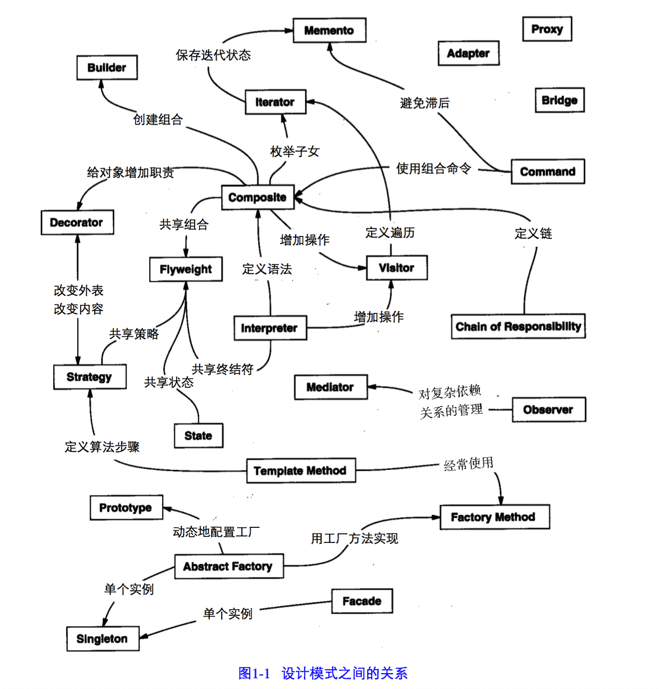

<!--more-->
> 设计模式（Design Pattern）是一套被反复使用、多数人知晓的、无数工程师实践的代码设计经验的总结，
> 它是面向对象思想的高度提炼和模板化，使用设计模式是为了让代码具有更高的可重用性，
> 更好的灵活性和可拓展性，更易被人阅读和理解。
## 七大开发原则
| 开发原则 | 归纳 | 目的 |
|:-----:|:---:|:-----:|
| 单一职责原则 | 一个类负责一项职责 | 便于理解，提高代码的可读性 |
| 里氏替换原则 | 不要破坏继承体系，子类重写方法功能发生改变，不应该影响父类方法的含义 | 防止继承泛滥 |
| 依赖倒置原则 | 高层不应该依赖低层，要面向接口编程 | 更利于代码结构的升级扩展 |
| 接口隔离原则 | 一个接口只干一件事，接口要精简单一，接口中的方法尽量少 | 功能解耦，高聚合、低耦合 |
| 迪米特法则 | 不该知道的不要知道，一个类应该保持对其它对象最少的了解，降低耦合度 | 减少代码臃肿 |
| 开闭原则 | 对扩展开放，对修改关闭 | 降低维护带来的新风险 |
| 组合/聚合复用原则 | 尽量使用组合或者聚合关系实现代码复用，少使用继承 | 降低代码耦合 |

## 24种设计模式

### 创建型模式
- 单例模式（Singleton）：确保一个类只有一个实例，并提供该实例的全局访问点。
- 工厂方法（Factory Method）：它定义了一个创建对象的接口，但由子类决定要实例化哪个类；工厂方法把实例化操作推迟到子类。
- 抽象工厂（Abstract Factory）：创建的是对象家族，也就是很多对象而不是一个对象，并且这些对象是相关的，也就是说必须一起创建出来；而工厂方法模式只是用于创建一个对象，这和抽象工厂模式有很大不同。
- 建造者模式（Builder）：封装一个对象的构造过程，并允许按步骤构造。
- 原型模式（Prototype）：使用原型实例指定要创建对象的类型，通过复制这个原型来创建新对象。
### 结构型模式
- 适配器（Adapter）：将一个类的接口，转换成客户期望的另一个接口；适配器让原本接口不兼容的类可以合作无间；对象适配器使用组合，类适配器使用多重继承。
- 桥接模式（Bridge）：使用桥接模式通过将实现和抽象放在两个不同的类层次中而使它们可以独立改变。
- 装饰器模式（Decorator）：动态地将责任附加到对象上，若要扩展功能，装饰者提供了比继承更有弹性的替代方案。
- 门面模式（Facade）：它提供了一个统一的接口，用来访问子系统中的一群接口，从而让子系统更容易使用。
- 享元模式（Flyweight）：利用共享的方式来支持大量细粒度的对象，这些对象一部分内部状态是相同的； 它让某个类的一个实例能用来提供许多"虚拟实例"。
- 组合模式（Composite）：允许你将对象组合成树形结构来表现"整体/部分"层次结构；组合能让客户以一致的方式处理个别对象以及对象组合。
- 代理模式（Proxy）：为另一个对象提供一个替身或占位符以控制对这个对象的访问。
### 行为型模式
- 模板方法（Template）：在一个方法中定义一个算法的骨架，而将一些步骤延迟到子类中；模板方法使得子类可以在不改变算法结构的情况下，重新定义算法中的某些步骤。
- 命令模式（Command）：将"请求"封闭成对象，以便使用不同的请求，队列或者日志来参数化其他对象；命令模式也支持可撤销的操作。
- 迭代器模式（Iterator）：提供一种方法顺序访问一个聚合对象中的各个元素，而又不暴露其内部的表示。
- 观察者模式（Observer）：在对象之间定义一对多的依赖，这样一来，当一个对象改变状态，依赖它的对象都会收到通知，并自动更新。
- 中介者模式（Mediator）：使用中介者模式来集中相关对象之间复杂的沟通和控制方式。
- 状态模式（State）：允许对象在内部状态改变时改变它的行为，对象看起来好象改了它的类。
- 策略模式（Strategy）：定义了算法族，分别封闭起来，让它们之间可以互相替换，此模式让算法的变化独立于使用算法的客户。
- 责任链模式（Chain of Responsibility）：为某个请求创建一个对象链；每个对象依序检查此请求并对其进行处理或者将它传给链中的下一个对象。
- 访问者模式（Visitor）：当你想要为一个对象的组合增加新的能力，且封装并不重要时，就使用访问者模式。
- 备忘录模式（Memento）：当你需要让对象返回之前的状态时（例如：你的用户请求“撤销”），你使用备忘录模式。
- 解释器模式（Interpreter）：使用解释器模式为语言创建解释器，通常由语言的语法和语法分析来定义。

